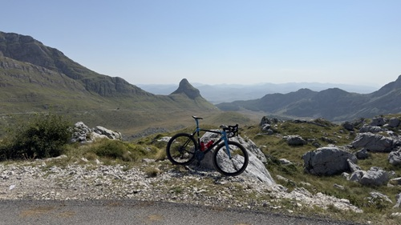

# Hello, my name is: Guillermo Wich 💼

## Contact Information 📬🌍: 
- **Email**: guillermo.wich@outlook.com
- **LinkedIn**: [My LinkedIn Profile](https://linkedin.com/in/guillermo-w-6b562050)
- **GitHub**: [My GitHub Profile](https://github.com/GuillermoW93)
- **Website**: [My Personal Website](https://guillermow.nl)

## Summary 🌟
I am a dedicated, detail-oriented professional who thrives on challenging projects that catalyze personal and technical growth. Passionate about modernizing legacy systems into agile/microservice-based infrastructures. 
I continuously seek new learning opportunities and innovative solutions to drive operational excellence and efficiency. 

## Skills 🛠️
- Ansible (Proficient, 4+ yrs)
- AWS Artefactory (Proficient, 1+ yrs)
- Bitbucket (Proficient, 4+ yrs)
- CommVault (Proficient, 4+ yrs)
- Docker (Proficient, 3+ yrs)
- Flask (Proficient, 3+ yrs)
- FlatCar (Proficient, 3+ yrs)
- Git (Experienced, 5+ yrs)
- Icinga2 (Proficient, 1+ yrs)
- Jenkins (Proficient, 3+ yrs)
- Kibana (Proficient, 3+ yrs)
- Linux (Experienced, 7+ yrs)
- Logstash (Proficient, 3+ yrs)
- MariaDB (Proficient/Experienced, 3+ yrs)
- Microsoft SQL Server (Proficient, 4+ yrs)
- Microsoft Windows Server (Experienced, 7+ yrs)
- Microsoft Windows Update Services (Experienced, 7+ yrs)
- MySQL (Proficient/Experienced, 3+ yrs)
- Netdata (Proficient, 1+ yrs)
- PowerShell (Proficient, 3+ yrs)
- Python (Proficient, 3+ yrs)
- Vim (Proficient/Experienced, 7+ yrs)
- YAML (Proficient/Experienced, 4+ yrs)
- ServiceNow (Proficient, 4+ yrs)
- Slack (Proficient, 1+ yrs)
- Solarwinds (Experienced, 3+ yrs)
- SNMP (Experienced, 3+ yrs)
- Squid (Proficient, 3+ yrs)
- Postfix (Proficient, 3+ yrs)
- Portainer (Proficient, 3+ yrs)
- Prometheus (Proficient, 1+ yrs)
- OpsGenie (Proficient/Experienced, 4+ yrs)
- OpenShift (Proficient, 1+ yrs)
- ArgoCD (Proficient, 1+ yrs)
- Helm (Umbrella Charts) (Proficient, 1+ yrs)
- GitLab Runner (Proficient, 1+ yrs)
- MinIO (Proficient, 1+ yrs)
- Azure DevOps (Proficient, 1+ yrs)
- Harbor (Proficient, 1+ yrs)

## Fun Facts 🧠
- Aspiring Kubestronaut (KCNA | CKA | CKAD)🚀🧑‍🚀
- Passionate about automating everything 🌟
- Automated my entire home with HA on Raspberry Pi.
- Fluent in Dutch, English, German and Russian. 
- Love cycling and exploring the wildest places.
- Currently working on: CKS/KCSA 🧑‍🚀

## Experience 🏢
### Cloud Native Consultant at TrueFullStaq
* **DevOps Engineer** at Ministerie van Binnelandse Zaken en Koninklijke Relaties
  * **Dates**: 2025-Present
    
  * **Responsibilities**:

    - Building highly-available Kubernetes platform on OpenShift for Government applications. 
    - Optimizing CI/CD pipelines in GitLab.
    - Implementing Cloud Native Postgres.
    - Implementing monitoring and logging.
    - Upgrading images/dependencies using Renovate
  

### IT Consultant at NiVo (Network, Cloud, Security)
* **DevOps Engineer** at KPN B.V.
  * **Dates**: 2022-2025
    
  * **Responsibilities**:

    - Migrated monolithic applications into containerized, microservices-driven solutions using FlatCar, Docker Swarm, and Portainer. Using CI/CD pipelines managed via Bitbucket, Jenkins, and AWS Artefactory.

    - Migrated and maintained core services including Postfix Mailrelay, a high-availability Solarwinds Monitoring cluster, and multiple database environments (MariaDB, Microsoft SQL Server, MySQL).

    - Migrated outdated portals and internal tools into Docker-applications using Flask, Python, LDAP, and HTML.
    
    - Implemented Ansible for system updates and feature deployments on CentOS/Linux environments.

    - Integrated OpsGenie with Solarwinds via PowerShell to support multi-tenant alerting, see my project **Link**: [Solarwinds-OpsGenie-MultiTenant-Solution](https://github.com/GuillermoW93/Solarwinds-OpsGenie-MultiTenant-Solution)

    - Upgraded all legacy SNMP configurations of legacy clients to SNMPv3 and automated network node management in Solarwinds.

    - Implemented Logstash and Kibana for Syslog-forwarding and log-analyzing in Kibana Dashboards

    - Additional Responsibilities: Maintained Windows Server environments with Puppet/WSUS, performed vulnerability management on Linux systems, and ensured consistent asset tracking via integration with ServiceNow

* **Network Engineer** on GGC-platform at Google Netherlands
  * **Dates**: 2019-2022
    
  * **Responsibilities**:
    - Spearheaded the deployment and maintenance of a Google Global Cache system across Eastern Europe to enable local ISPs to serve YouTube content directly within their networks.

    - Oversaw a Linux-based network environment and assorted hardware, ensuring seamless content delivery for YouTube, Google Apps, and Google Drive.

    - Worked directly with ISPs and Internet Exchanges to optimize installations, troubleshoot issues, and scale capacity—both through physical hardware extensions and virtual uplink expansions.

    - Proactively tackled technical challenges, driving process automation and performance enhancements through detailed technical analyses.

    - More details about the GGC Project can be found [here](https://support.google.com/interconnect/answer/9058809?hl=en)

### Bachelor of Science (BSc) Thesis Intership
* **Intern** at Redkiwi (Digital Marketing Agency)
  * **Dates**: 2018-2019
    
  * **Responsibilities**:
    - Analyzed and identified gaps in existing monitoring setups; spearheaded the consolidation initiative to create a centralized and proactive monitoring solution.

    - Designed and deployed a high-availability Icinga2-cluster + Graphite-module for real-time metrics.
    
    - Automated configuration changes using Ansible.

    - Implemented Slack using webhooks for alerting.

### On-call Jr. ICT Infra Engineer at Ewals Cargo Care
  * **Dates**: 2012-2016
    
  * **Responsibilities**:
    - Implemented Windows Deployment Services and Windows Server Update Services with a custom Windows 7 Professional Image. This could be deployed with the corresponding applications based on co-location offices.
    
    - Troubleshooting of network and applications.

    - Installation of workplaces with desktops/telephones/monitors.
        
    - Support via e-mail and telephone in English, German and Dutch language.

    - Installation of hardware and netgear in co-location offices.

## Education 🎓
### Bachelor of Science (BSc) at ZUYD University of Applied Sciences
- **Dates**: 2014 - 2019

## Projects 🚀
### **Solarwinds OpsGenie MultiTenant Solution**
- **Description**: 🚀 PowerShell Multi-Tenant Integration for Solarwinds and OpsGenie 🌟 Not natively supported in version Solarwinds HCO 2025.1
- **Link**: [Solarwinds-OpsGenie-MultiTenant-Solution](https://github.com/GuillermoW93/Solarwinds-OpsGenie-MultiTenant-Solution)

### **Horoscope Bot with Telegram Integration**
- **Description**: 🌟 Horoscope Bot 🌟 Let the stars guide you every day! 💫
- **Link**: [Horoscope Bot with Telegram Integration](https://github.com/GuillermoW93/horoscope-bot)

### **Some Python Games**
- **Description**: 🎮 Some classic Python Games, enjoy! 🎲
- **Link**: [Some-Python-Games](https://github.com/GuillermoW93/Some-Python-Games)

## Certifications 📜

